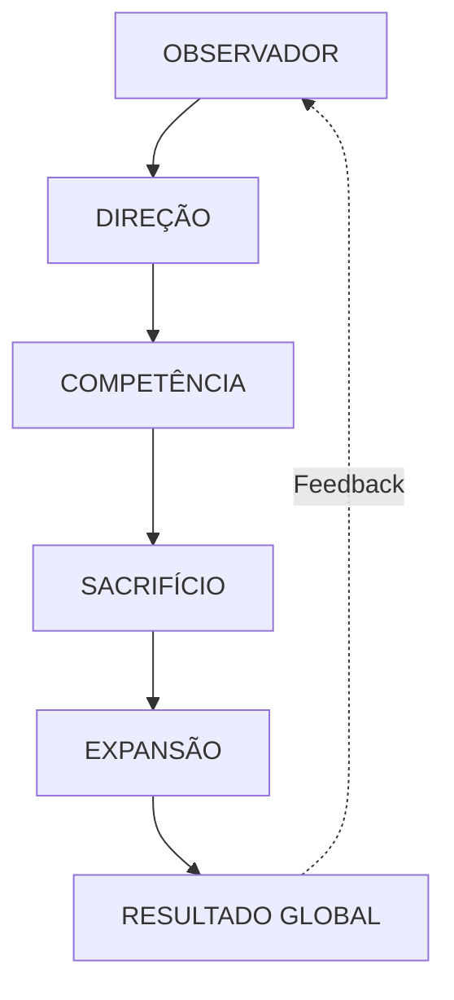

# Arquitetura Técnica — Long View3

## Visão Geral do Sistema

O Long View3 é uma plataforma institucional de alta performance baseada em uma arquitetura de "Single Source of Truth" (Zustand) e renderização modular (React + Suspense).

### O Método Quântico (Fluxo Lógico)

## Stack Tecnológico

- **Core**: React 19 (Hooks, Suspense, Lazy)
- **State Management**: Zustand (Persistência em LocalStorage)
- **UI/UX**: Tailwind CSS + Custom Design System
- **Intelligence**: Gemini API (Model: gemini-3-flash-preview)
- **Tracking**: GA4 + Hotjar + Custom Analytics Service
- **Export**: jsPDF (Auditoria SMQ)

## Decisões Arquiteturais

1. **Cognição Híbrida**: O sistema utiliza um clone cognitivo (Antony.ia) para validar teses de negócio em tempo real via Gemini, utilizando um prompt altamente restritivo (Zero-Shot Chain of Thought).
2. **Scroll Narrativo**: A interface é construída como um manifesto linear para garantir que a filosofia do método seja absorvida antes da conversão.
3. **Maturidade (SMQ)**: O diagnóstico é quantitativo e recalcula o radar energético a cada interação, persistindo o estado para garantir continuidade em sessões futuras.
4. **Resiliência Mobile**: ChatInterface otimizada para "Mobile-First" com drawers, touch targets de 44px e keyboard-aware layout.
